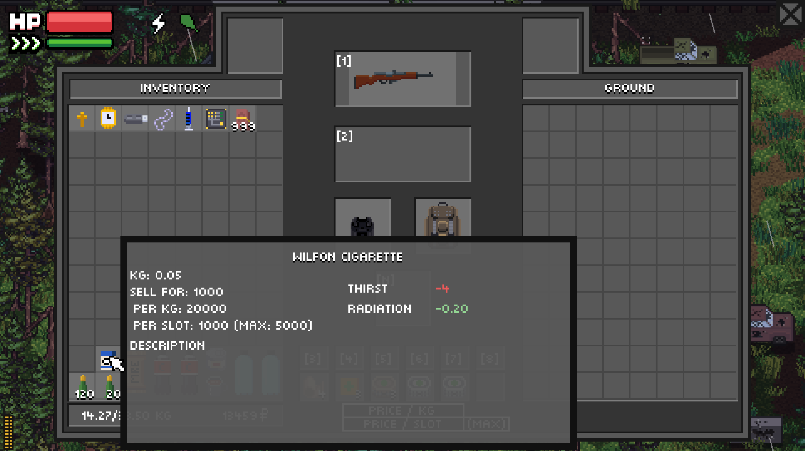
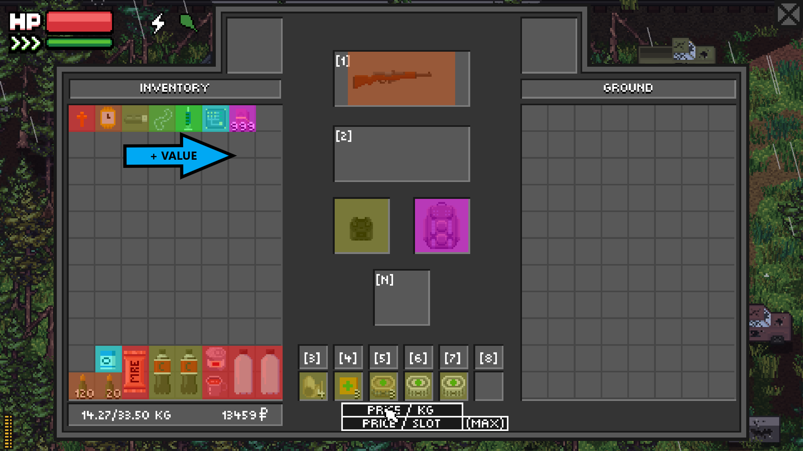

# ZERO Sievert MOD: PDA for Advanced Prices in Hunts

## Description

Now our brave hunter has acquired a PDA (Personal Digital Assistant), which will receive by radio frequency an updated price list from the radios of nearby merchants. In future updates it will be mandatory to install an Intelligence Center module (or something like that) in order to receive advanced information.

The PDA will display information such as:
- Selling price of each item (and of the stack)
- Selling price per kg
- Selling price per slot (and of the maximum stack)

The PDA will be able to analyze all the items and display overlays in the inventory:
- Selling price per kg of each item
- Selling price per slot of each item
- Selling max price per slot of each item

## Installation

Last version: v0.29.4

1. Check that the version of your game matches the last version of the mod.
2. Download the `data.win` [here](https://github.com/Glitched-Out/zero-sievert-mods/releases/download/v0.29.4/pda_prices_mod.zip).
3. Go to the installation folder of your game (the folder where you can find `ZERO Sievert.exe`).
4. Make a backup of the original `data.win` in case you want to play again without the mod.
5. Replace the `data.win` file with the file you just downloaded.
6. Run the game.

## Future ideas

- The PDA can be obtained by completing a quest, buying it, or crafting it.
- The PDA will be obtained by installing a module in the base.
